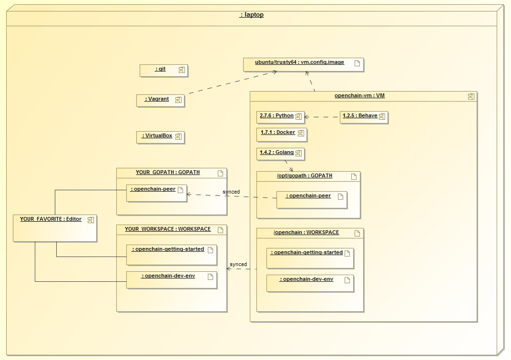

# Hyperledger Development Environment

This is the Hyperledger development environment project which is used for bootstrapping the hyperledger development environment on your laptop or server.

Below is a deployment diagram of the current develpment environment. Note that version numbers may be out of date.


## Setting up the development environment

### Overview
The current development environment utilizes Vagrant running an Ubuntu image, which in turn launches Docker containers. Conceptually, the Host launches a VM, which in turn launches Docker containers.

**Host -> VM -> Docker**

This model allows developers to leverage their favorite OS/editors and execute the system in a controlled environment that is consistent amongst the development team.

- Note that your Host should not run within a VM. If you attempt this, the VM within your Host may fail to boot with a message indicating that VT-x is not available.

### Prerequisites
* [Git client](https://git-scm.com/downloads)
* [Go](https://golang.org/) - 1.5.2 or later
* [Vagrant](https://www.vagrantup.com/) - 1.7.4 or later
* [VirtualBox](https://www.virtualbox.org/) - 5.0 or later
* BIOS Enabled Virtualization - Varies based on hardware

- Note: The BIOS Enabled Virtualization may be within the CPU or Security settings of the BIOS

### Steps

#### Set your GOPATH
Make sure you have properly setup your Host's [GOPATH environment variable](https://github.com/golang/go/wiki/GOPATH). This allows for both building within the Host and the VM.

#### Note to Windows users

If you are running Windows, before running any `git clone` commands, run the following command.
```
git config --get core.autocrlf
```
If `core.autocrlf` is set to `true`, you must set it to `false` by running
```
git config --global core.autocrlf false
```
If you continue with `core.autocrlf` set to `true`, the `vagrant up` command will fail with the error `./setup.sh: /bin/bash^M: bad interpreter: No such file or directory`

#### Cloning the Open Blockchain Peer project

Create a fork of the [obc-peer](https://github.com/hyperledger-incubator/obc-peer) repository using the GitHub web interface. Next, clone your fork in the appropriate location.

```
cd $GOPATH/src
mkdir -p github.com/hyperledger-incubator
cd github.com/hyperledger-incubator
git clone https://github.com/<username>/obc-peer.git
```


#### Cloning the Open Blockchain Development Environment project
Choose another location (**NOT** within the GOPATH directory tree) which will be referred to as the WORKSPACE. Change to this chosen WORKSPACE directory and clone the [obc-dev-env](https://github.com/hyperledger-incubator/obc-dev-env) repository.

    cd WORKSPACE
    git clone https://github.com/hyperledger-incubator/obc-dev-env.git


#### Boostrapping the VM using Vagrant    

Now change to the WORKSPACE/obc-dev-env directory and run the following command:

    vagrant up

**NOTE:** If you intend to run the development environment behind an HTTP Proxy, you need to configure the guest so that the provisioning process may complete.  You can achieve this via the *vagrant-proxyconf* plugin. Install with *vagrant plugin install vagrant-proxyconf* and then set the VAGRANT_HTTP_PROXY and VAGRANT_HTTPS_PROXY environment variables *before* you execute *vagrant up*. More details are available here: https://github.com/tmatilai/vagrant-proxyconf/


Once complete, you should now be able to SSH into your new VM with the following command from the same WORKSPACE/obc-dev-env directory.

    vagrant ssh

Once inside the VM, you can find your WORKSPACE directory under /hyperledger and the obc-peer project under $GOPATH/src/github.com/hyperledger-incubator/obc-peer. Additional [instructions](https://github.com/hyperledger-incubator/obc-peer/blob/master/README.md) describe how to build, run and test the Open Blockchain Peer project.

**NOTE:** any time you *git clone* any of the projects in your Host's WORKSPACE, the update will be instantly available within the VM /hyperledger directory.

### Storage Backends

You may optionally choose a docker storage backend other than the default.

For a comparison of the assorted storage backends refer to [select a storage driver](https://docs.docker.com/engine/userguide/storagedriver/selectadriver/)

Presently, the default is set to AUFS, but this may change in the future.

To select a different storage backend (btrfs in this example), simply execute

```
vagrant destroy
DOCKER_STORAGE_BACKEND=btrfs vagrant up
```

Currently supported backends are btfs, and aufs, with more to be added in the future.
